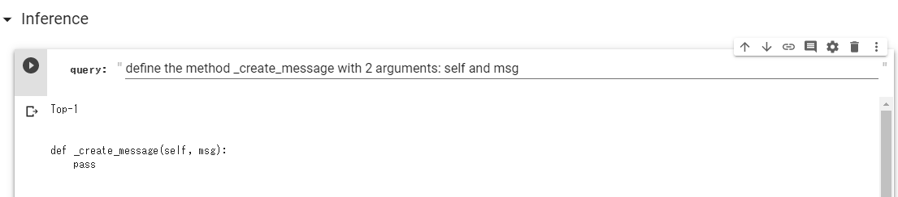

NL2Code-reimplementation
===

This repository is a reimplementation of NL2Code proposed in the [paper](https://arxiv.org/abs/1704.01696). NL2Code can synthesize the source code of a general purpose language (such as Python) from the natural language description.
The official implementation is available in the [GitHub repository](https://github.com/pcyin/NL2code/).


Notice (Dec/1/2019)
---

I rewrote the implementation from scratch. The previous implementation is in the v0.0.0 tag.


Comparison with Official Implementation
---

### Performance (*Django Dataset)

|         |Accuracy|BLEU4|
|---------|-------:|----:|
|original |   71.6%|84.5%|
|this repo|   72.4%|86.8%|

The details of the training results are shown in `result` directory.


### Difference

I noticed that there are some differences between this implementation and the official one.
The followings summarize the differences.

#### version of Python
The original implementation used Python 2.x but this repository uses Python 3.x (I tested with the Python 3.7.4).

#### tested dataset
Although the paper tested NL2Code with [*Django* dataset](https://github.com/odashi/ase15-django-dataset), HEARTHSTONE dataset, and IFTTT dataset, this implementation is tested with *Django* dataset only.

#### definitions of action sequence
The original implementation added the cast action and did not support actions that have variadic childrens.
This implementation omits the cast action and supports actions with variadic childrens.

#### maximum length of query and action sequences
The origianl implementation limits the length of query and action sequence because Theano employes Define-and-Run style.
This implementation does not set the maximum length because of PyTorch Define-by-Run style.

Usage
---

### Setup
### Requirements
#### Colab
* Google acount

#### Local Runtime
* Linux (I think the code works in macOSes, but I have not tested.)
* Python 3.x (tested with Python 3.7.4)

### Installation (if use local runtimes)

```bash
$ git clone https://github.com/HiroakiMikami/NL2Code-reimplementation nl2code
$ cd nl2code
$ pip install .
$ pip install . -e ["django"]
$ pip install . -e ["colab"]
```


### Quickstart

`inference.ipynb` synthesize the Python source code using pre-training model.




### Training with *Django* Dataset

*Warning The notebook in the examples directory will use Google Drive as data storage. Please be careful not to overwrite your data!*

The [*Django* dataset](https://github.com/odashi/ase15-django-dataset) is a collection of code with manually annotated description. The code comes from the Django web framework.

The notebooks in `examples/django` directory show how to train NL2Code with *Django* dataset. Training consisits of the following steps:

1. Download dataset (`examples/django/download_dataset.ipynb`)
2. Train and validate with the *Django* dataset (`examples/django/train.ipynb`)


TODO/Future Plan
---

* [ ] (TODO) Tests with other dataset
* [ ] (Future Plan) Use TPU


References
---

* [A Syntactic Neural Model for General-Purpose Code Generation, ACL2017](https://arxiv.org/abs/1704.01696)
* [the official GitHub repository](https://github.com/pcyin/NL2code/)
* [Learning to Generate Pseudo-code from Source Code Using Statistical Machine Translation, ACE2-15](https://ieeexplore.ieee.org/document/7372045)

