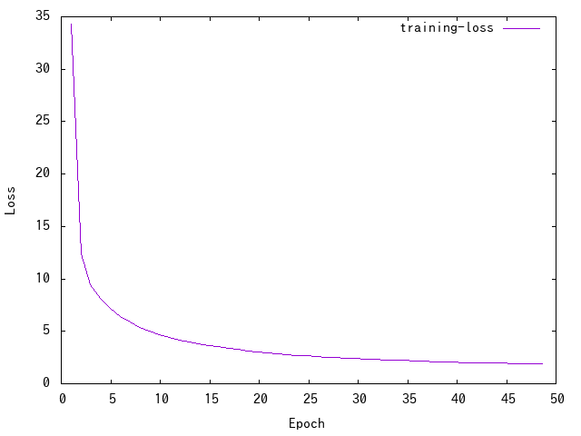

NL2Code-reimplementation
===

This repository is a reimplementation of NL2Code proposed in the [paper](https://arxiv.org/abs/1704.01696). NL2Code can synthesize the source code of a general purpose language (such as Python) from the natural language description.
The official implementation is available in the [GitHub repository](https://github.com/pcyin/NL2code/).

Although the paper tested NL2Code with [*Django* dataset](https://github.com/odashi/ase15-django-dataset), HEARTHSTONE dataset, and IFTTT dataset, this implementation is tested with *Django* dataset only.

Requirements
---
* Python 3.x (tested with Python 3.6.6)
* Cuda 10 (optional but recommended)

Setup
---

```bash
$ git clone https://github.com/HiroakiMikami/NL2Code-reimplementation.git
$ cd NL2Code-reimplementation
$ pip install -r ./requirements.txt
$ python -m nltk.downloader all
```

The additional command is required to use a GPU:

```bash
$ pip install -r ./gpu-requirements.txt
```

*Django* dataset
---

The [*Django* dataset](https://github.com/odashi/ase15-django-dataset) is a collection of code with manually annotated description. The code comes from the Django web framework.

The table shows the performance of this method for the Django dataset.
I don't know why this implementation gets higher accuracy and BLEU4 than the original implementation. But the difference of the Python version might be factored (this repository uses Python 3.6, but the paper used Python 2.x).

|         |Accuracy|BLEU4|
|---------|-------:|----:|
|original |   71.6%|84.5%|
|this repo|   74.7%|85.9%|


### 1. Use Pre-Trained Model

`scripts/django/interactive.bash` receives the natural language description from stdin, and outputs the synthesized code.

```bash
$ ./scripts/django/interactive.bash
2018-12-22 12:41:39,624 [nnabla][INFO]: Initializing CPU extension...
2018-12-22 12:41:40,368 [nnabla][INFO]: Running in cpu
2018-12-22 12:41:40,369 [nnabla][INFO]: Load grammar/words info
2018-12-22 12:41:40,376 [nnabla][INFO]: Load parameter
2018-12-22 12:41:40,510 [nnabla][INFO]: Parameter load (<built-in function format>): ./scripts/django/../..//result/django/model.h5
2018-12-22 12:41:40,510 [nnabla][INFO]: Prepare decoder # WARNING: this take long time
# The below line is a query written by natural language
>for every p in parts
2018-12-22 12:43:30,677 [transpyle][WARNING]: C unavailable
2018-12-22 12:43:30,678 [transpyle][WARNING]: C++ unavailable
2018-12-22 12:43:30,679 [transpyle][WARNING]: Fortran unavailable
2018-12-22 12:43:33,294 [nnabla][INFO]: 
# The below text is a Python source code synthesized by the pre-trained model
for p in parts:
    pass
```

### 2. Train *Django* dataset

The training will take about 5 days with CPU and about 15 hours with K80 GPU.

```bash
$ ./scripts/django/prepare_dataset.bash # Download and preprocess dataset
...
$ ./scripts/django/train.bash -c cudnn # -c cudnn is required to use GPU
2018-12-22 12:50:16,522 [nnabla][INFO]: Initializing CPU extension...
2018-12-22 12:50:17,342 [nnabla][INFO]: Running in cpu     
2018-12-22 12:50:17,343 [nnabla][INFO]: Load dataset       
2018-12-22 12:50:21,961 [nnabla][INFO]: Load test dataset  
2018-12-22 12:50:22,466 [nnabla][INFO]: Get words/token vocabulary
2018-12-22 12:50:22,642 [nnabla][INFO]: Save grammar/words info
2018-12-22 12:50:24,229 [nnabla][INFO]: Prepare dataset
...
```

The training of my experiment:



### 3. Validate Trained Model

```bash
$ ./scripts/django/valid.bash -c cudnn # -c cudnn is required to use GPU
...
2018-12-22 13:00:03,207 [nnabla][INFO]: iter=1 {validation-accuracy}=0.747028
2018-12-22 13:00:03,207 [nnabla][INFO]: iter=1 {validation-bleu4}=0.859477
```

TODO/Future Plan
---

* [ ] (TODO) Tests with other dataset
* [ ] (Future Plan) Optimize the performance
* [ ] (Future Plan) Rewrite neural network in Tensorflow or PyTorch to use TPU

References
---

* [A Syntactic Neural Model for General-Purpose Code Generation, ACL2017](https://arxiv.org/abs/1704.01696)
* [the official GitHub repository](https://github.com/pcyin/NL2code/)
* [Learning to Generate Pseudo-code from Source Code Using Statistical Machine Translation, ACE2-15](https://ieeexplore.ieee.org/document/7372045)